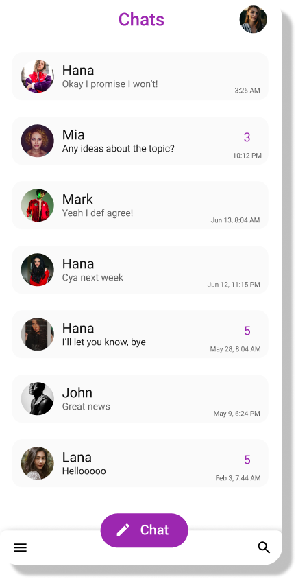
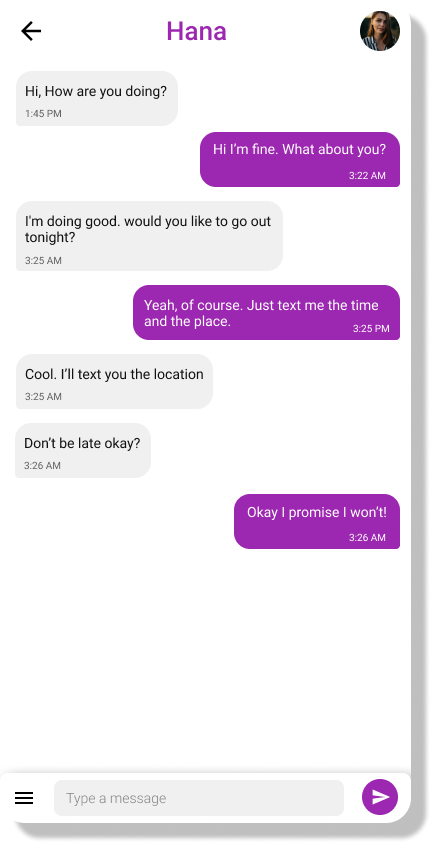

# ChatyChaty

#### Android chats application built using kotlin.

## Motivation

The app is a part of my [portfolio](https://alialbaali.com) projects. It showcases my skills regarding developing Android apps.

## Download

You can download the app apk using this [link](https://github.com/alialbaali/ChatyChaty/releases/download/v1.1.0/ChatyChaty.apk).

## Screenshots




## Features

* Dark mode
* Archive chats
* Minimal design
* Real-time communication using websockets

## Libraries

* Android Architecture Components
* Kotlin
* Data Binding
* Room (DB)
* Koin (DI)
* Retrofit
* Moshi
* Okhttp

## Architecture

> The app uses Clean Architecture with MVVM design pattern. It's divided into 3 main modules.

#### Domain

Contains all the models. It's split into 2 packages.

* ##### Model
  Contains app models.

* ##### Repository
  Contains repositories interfaces which are used by ViewModels and implemented in the `Data` module.

#### Data

Contains repositories implementations and DataSources interfaces. It's split into 2 packages.

* ##### Local
  Contains interfaces to preform actions locally and implemented in the `Local` module.

* ##### Remote
  Contains interfaces to preform actions remotely and implemented in the `Remote` module.

#### Presentation (app)

Contains all the UI and business logic.

### Other modules

#### DI (Dependency Injection)

Contains Koin DI modules.

#### BuildSrc

Contains gradle dependencies and app configuration.

#### Remote
Contains network data sources implementations.

#### Local
Contains database data sources implementations.

## Requirements

* JDK 11
* [Android SDK](https://developer.android.com/studio/index.html)
* Android N (API 23)
* Latest Android SDK Tools and build tools.

## Running

```
./gradlew
```

## License

ChatyChaty is distributed under the terms of the Apache License (Version 2.0). See [License](LICENSE.md) for details.
